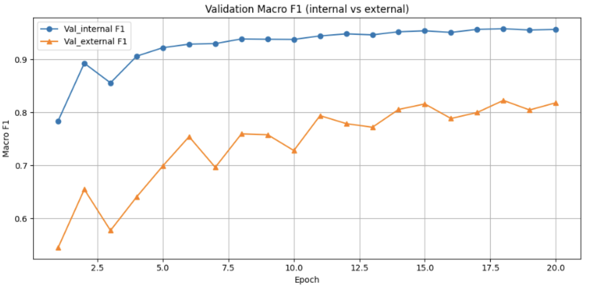

<div align="center">

# 🛡️ FaceGuard

### 설명 가능한 AI 기반 딥페이크 탐지 시스템

[](https://www.python.org/)
[](https://pytorch.org/)
[](https://streamlit.io/)

### 🎯 핵심 성과
<p align="center">
  
</p>

📊 [Val_internal] Macro F1=0.9580 | Acc=0.9675
              precision    recall  f1-score   support

     Real(0)      0.917     0.960     0.938      5516
     Fake(1)      0.986     0.970     0.978     15992

    accuracy                          0.968     21508
   macro avg      0.952     0.965     0.958     21508
weighted avg      0.968     0.968     0.968     21508

--------------------------------------------------------------------------------

📊 [Val_external] Macro F1=0.8227 | Acc=0.8776
              precision    recall  f1-score   support

     Real(0)      0.583     0.957     0.724       391
     Fake(1)      0.990     0.862     0.921      1937

    accuracy                          0.878      2328
   macro avg      0.786     0.909     0.823      2328
weighted avg      0.921     0.878     0.888      2328

**FSFM+ArcFace 기반 얼굴 위변조 탐지 및 Grad-CAM 시각화**

</div>

---

## 🎯 연구 개요

딥페이크 기술의 급속한 발전으로 인한 사회적 위험성 증가에 따라, **설명 가능한 AI(XAI)** 기반의 신뢰할 수 있는 탐지 시스템을 개발했습니다.

### 프로젝트 정보
- **기간**: 2024.10.13 ~ 2024.11.20 (5주)
- **팀 구성**: 2명
- **역할**: 프로젝트 리더 / 모델 아키텍처 설계, 데이터 파이프라인 구축

### 연구 목표
1. 일반화 성능 향상 (다양한 딥페이크 기법 대응)
2. XAI 기반 설명 가능성 확보
3. 한국인 특화 데이터셋 구축
4. 실용적 웹 플랫폼 구현

---

## 📚 관련 연구

### 주요 참고 논문 (30+ 논문 리뷰)

**핵심 참고 문헌**:
- FaceForensics++ (ICCV 2019) - 대규모 딥페이크 데이터셋
- FSFM (2024) - 얼굴 특화 Foundation Model
- RetinaFace (CVPR 2020) - 실시간 얼굴 검출
- ViT Deepfake Detection (IEEE TIFS 2023) - Transformer 기반 탐지
- Deepfake Detection Survey (ACM 2023) - 종합 서베이

**추가 리뷰 논문** (카테고리별):
- **데이터셋**: Celeb-DF, DFDC, DeeperForensics-1.0, KoDF
- **탐지 알고리즘**: Xception, EfficientNet, Self-Supervised Learning, Multitask Learning
- **멀티모달**: Audio-Visual Fusion (CVPR 2024), Vision-Language Models
- **메타 분석**: Deepfake Meta-Review (2024), Multimedia Survey (2025)
- **기반 기술**: StyleGAN, ArcFace, Grad-CAM
- **법적/사회적**: EU AI Act, Europol Deepfake Report

### 💡 본 연구의 차별점

| 구분 | 기존 연구 | 🚀 본 연구 |
|------|----------|---------|
| **모델** | ViT 기반 범용 모델 | **FSFM + ArcFace 얼굴 특화** |
| **데이터** | FaceForensics++ (외국인 중심) | **StyleGAN-K 한국인 데이터 추가** |
| **후처리** | 단일 프레임 분석 | **Top-K + Auto-Threshold** |
| **설명성** | Class Activation Map | **Grad-CAM + 신뢰도 추이** |
| **성능** | Macro F1 0.49 | **✨ Macro F1 0.823 (+68.4%)** |

---

## 🏗️ 모델 아키텍처

### 베이스라인 모델 조사

11가지 딥페이크 탐지 모델을 **공간/시간/주파수** 관점에서 벤치마킹:

<p align="center">
  
</p>

**선정 과정**:
- **베이스라인**: Xception (필수지표 달성)
- **공간 기반**: EfficientNet-B4 (성능·효율성 우수)
- **시간 기반**: **ViT (Vision Transformer)** - F1-score 최고 (0.49)
- **주파수/학률**: PixelCNN

<p align="center">
  
</p>

**최종 선정**: **ViT (Vision Transformer)**
- FaceForensics++: AUC 0.997 (완벽한 성능)
- Celeb-DF: AUC 0.482 (일반화 한계 발견)

<p align="center">
  
</p>

> **"같은 구조의 CNN 모델이라도 훈련 데이터셋을 벗어나는 순간 성능이 무너진다."**
>
> 이것이 현재 연구가 가진 일반화 한계점

### ViT 베이스라인의 구조적 한계

<p align="center">
  
</p>

**발견된 문제점**:
- ✅ **일반 객체 인식**에는 강하지만, **얼굴·딥페이크 특유의 미세 위조 흔적**을 충분히 반영하지 못함
- ✅ 전역 정보에는 강하지만, **고주파(High-frequency) 아티팩트·경계 이상치 감지**에 취약
- ✅ 균일 패치 처리 방식 때문에 **눈·입 주변의 위조 흔적 (블러·경계 깨짐)** 을 놓칠 가능성 높음

### 💡 해결 방안

> **FSFM (얼굴 특화 모델) + ArcFace로 전환**
>
> ## 🎯 결과: **성능 68.4% 향상**

---

## 📊 데이터셋 구축

### StyleGAN-K 기반 한국인 데이터 생성

<p align="center">
  
</p>

**생성 과정**:
1. **Z (Latent Vector)** → StyleGAN Generator → 한국인 얼굴 생성
2. **FaceNet**으로 Face Embedding 추출 (123-dimensional vectors)
3. **L2 Distance** 기반 Gradient Descent 최적화
4. **결과**: 약 5,000장의 고품질 한국인 Fake 데이터

### 최종 데이터 분포
```python
국적 분포:     KR:Global = 42:58
레이블 분포:   Real:Fake = 26:74
모달리티:      Video:Image = 70:30
```

---

## 🧪 실험 결과 (FSFM+ArcFace)

### 학습 파이프라인

<p align="center">
  
</p>

**파이프라인 구성**:
- **Preprocessing**: RetinaFace 얼굴 검출 → Face Crop (224×224) → 데이터 증강 (Horizontal Flip, Color Jitter, Gaussian Blur, BlindFace)
- **Model Predict**: FSFM Vision Transformer → Global Feature Pool → ArcFace 얼굴분류 → Real/Fake 판별 (Top-K + Auto-Threshold)

### 성능 개선 과정

<p align="center">
  
</p>

#### 단계별 개선 내역

<p align="center">
  
</p>

| 단계 | 모델/기법 | Macro F1 | 주요 개선 사항 |
|------|-----------|----------|---------------|
| Baseline | ViT (불균형) | 0.38 | - |
| V1 | 얼굴 특화 베이스라인 | **0.60** | ViT→FSFM ViT-B 전환 |
| V2 | 학습 안정화 | **0.74** | LR/ArcFace 마진 조정, Gradient Clipping |
| **✨ V3** | **파이프라인 고도화** | **🎯 0.82** | **Top-K + Auto-Threshold** |

<div align="center">

## 🏆 최종 성과

### 베이스라인 대비 **90.7% 성능 향상**
### Macro F1-Score: **43% → 82%**

</div>

---

## 🖥️ 시스템 구현

### 핵심 6가지 기능

<p align="center">
  
</p>

**01. 조작 부분 시각화 (히트맵)**
- Grad-CAM 기반 딥페이크 조작 영역 시각화

**02. 딥페이크 구간 추이 분석**
- 비디오의 프레임별 신뢰도 추이 실시간 그래프 제공

**03. 딥페이크 기법 판별**
- 12가지 딥페이크 기법과 AI 생성 이미지 자동 분류 및 상세 설명

**04. 얼굴 자동 검출**
- RetinaFace 기반 얼굴 자동 검출 (30% margin 확장)

**05. 임계치 자동 조정**
- 상위 K개 프레임 평균과 동적 임계값 조정

**06. 실시간 판별 기록 대시보드**
- 여러 이미지를 한번에 업로드하여 빠르고 효율적인 일괄 분석

### 결과 화면

<p align="center">
  
</p>

**AI 분석 결과**: 정상적인 실제 이미지로 확인되었습니다
- 얼굴 진체적으로 일관된 텍스처와 자연스러운 조명 분포 확인
- 딥페이크에서 나타나는 특징적인 아티팩트나 부자연스러운 패턴이 발견되지 않음


---

## 📚 참고문헌

> **30개 이상의 최신 논문**을 체계적으로 리뷰하여 연구 설계

<details>
<summary><b>📖 주요 참고 문헌 보기</b></summary>

- **데이터셋**: FaceForensics++, Celeb-DF, DFDC, KoDF
- **탐지 모델**: FSFM, ViT, Xception, EfficientNet
- **XAI**: Grad-CAM, Active Illumination
- **멀티모달**: Audio-Visual Fusion, Vision-Language Models
- **서베이**: Deepfake Meta-Review, Multimedia Survey
- **법적/사회적**: EU AI Act, Europol Report

</details>

---

## 👥 팀 정보

**이승규** (프로젝트 리더)
- 역할: 모델 아키텍처, 데이터 파이프라인, 시스템 구현
- GitHub: [@GYULEE55](https://github.com/GYULEE55)

---

<div align="center">

**FaceGuard: Explainable Deepfake Detection System**


</div>
